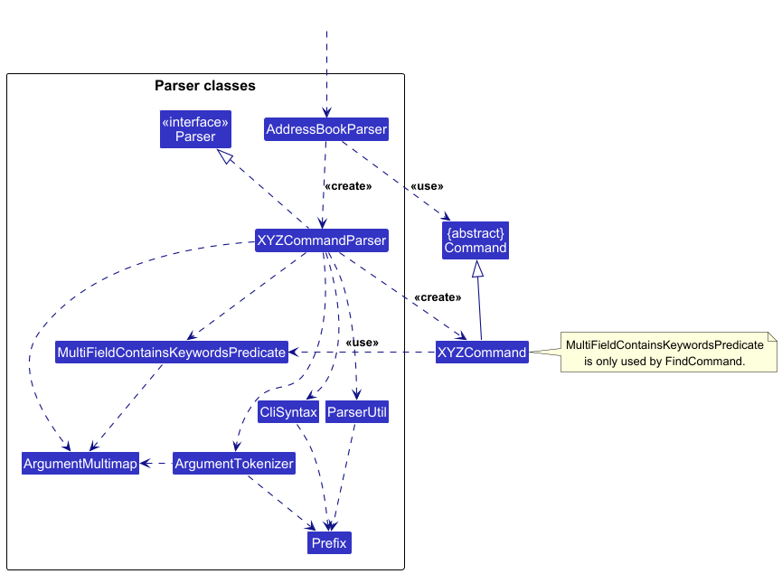
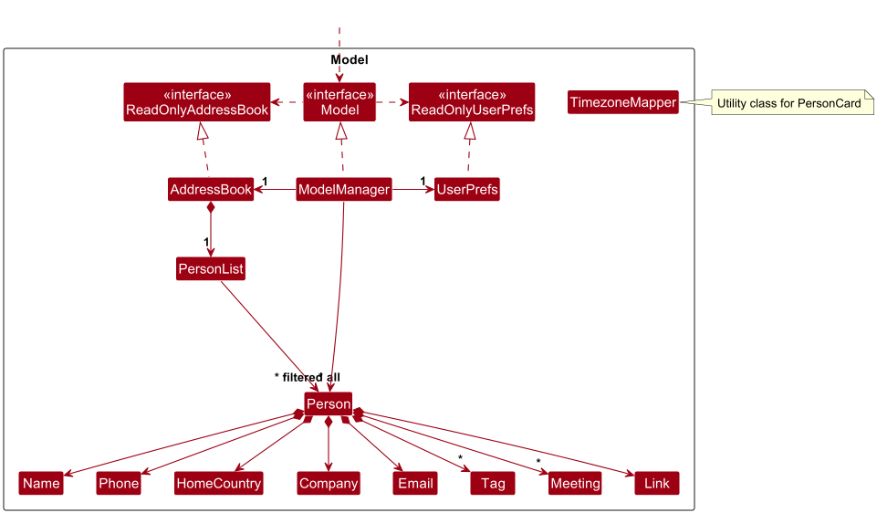

* Table of Contents
{:toc}

--------------------------------------------------------------------------------------------------------------------

## **Acknowledgements**

* This project was adapted from the [AddressBook-Level3 (AB3)](https://github.com/se-edu/addressbook-level3) project by the [SE-EDU initiative](https://se-education.org/).
  We thank the SE-EDU teaching team for providing the foundational architecture, testing framework, and documentation templates used in Wi-Find.

* This project also uses the following open-source libraries and tools:
  - [JavaFX](https://openjfx.io/) - for building the Graphical User Interface (GUI).
  - [Jackson](https://github.com/FasterXML/jackson) - for JSON serialization and deserialization. 
  - [JUnit 5](https://junit.org/junit5/) - for automated testing. 
  - [Java 17 SDK](https://www.oracle.com/java/technologies/javase/jdk17-archive-downloads.html) - for compiling and running the program. 
  - [Checkstyle](https://checkstyle.sourceforge.io/) - for enforcing consistent coding style. 
  - [Gradle](https://gradle.org/) - for build automation and dependency management. 
  - [GitHub Actions](https://github.com/features/actions) - for Continuous Integration (CI) testing.

--------------------------------------------------------------------------------------------------------------------

## **Setting up, getting started**

Refer to the guide [_Setting up and getting started_](SettingUp.md).

--------------------------------------------------------------------------------------------------------------------

## **Design**

:bulb: **Tip:** The `.puml` files used to create diagrams are in this document `docs/diagrams` folder. Refer to the [_PlantUML Tutorial_ at se-edu/guides](https://se-education.org/guides/tutorials/plantUml.html) to learn how to create and edit diagrams.

### Architecture

The ***Architecture Diagram*** given above explains the high-level design of the App.

Given below is a quick overview of main components and how they interact with each other.

**Main components of the architecture**

**`Main`** (consisting of classes [`Main`](https://github.com/AY2526S1-CS2103T-T15-4/tp/blob/master/src/main/java/seedu/address/Main.java) and [`MainApp`](https://github.com/AY2526S1-CS2103T-T15-4/tp/blob/master/src/main/java/seedu/address/MainApp.java)) is in charge of the app launch and shut down.
* At app launch, it initializes the other components in the correct sequence, and connects them up with each other.
* At shut down, it shuts down the other components and invokes cleanup methods where necessary.

The bulk of the app's work is done by the following four components:

* [**`UI`**](#ui-component): The UI of the App.
* [**`Logic`**](#logic-component): The command executor.
* [**`Model`**](#model-component): Holds the data of the App in memory.
* [**`Storage`**](#storage-component): Reads data from, and writes data to, the hard disk.

[**`Commons`**](#common-classes) represents a collection of classes used by multiple other components.

**How the architecture components interact with each other**

The *Sequence Diagram* below shows how the components interact with each other for the scenario where the user issues the command `delete 1`.

Each of the four main components (also shown in the diagram above),

* defines its *API* in an `interface` with the same name as the Component.
* implements its functionality using a concrete `{Component Name}Manager` class (which follows the corresponding API `interface` mentioned in the previous point.

For example, the `Logic` component defines its API in the `Logic.java` interface and implements its functionality using the `LogicManager.java` class which follows the `Logic` interface. Other components interact with a given component through its interface rather than the concrete class (reason: to prevent outside component's being coupled to the implementation of a component), as illustrated in the (partial) class diagram below.

The sections below give more details of each component.

### UI component

The **API** of this component is specified in [`Ui.java`](https://github.com/AY2526S1-CS2103T-T15-4/tp/blob/master/src/main/java/seedu/address/ui/Ui.java)

The UI consists of a `MainWindow` that is made up of parts e.g.`CommandBox`, `ResultDisplay`, `PersonListPanel`, `StatusBarFooter` etc. All these, including the `MainWindow`, inherit from the abstract `UiPart` class which captures the commonalities between classes that represent parts of the visible GUI.

The `UI` component uses the JavaFx UI framework. The layout of these UI parts are defined in matching `.fxml` files that are in the `src/main/resources/view` folder. For example, the layout of the [`MainWindow`](https://github.com/AY2526S1-CS2103T-T15-4/tp/blob/master/src/main/java/seedu/address/ui/MainWindow.java) is specified in [`MainWindow.fxml`](https://github.com/AY2526S1-CS2103T-T15-4/tp/blob/master/src/main/resources/view/MainWindow.fxml)

The `UI` component,

* executes user commands using the `Logic` component.
* listens for changes to `Model` data so that the UI can be updated with the modified data.
* keeps a reference to the `Logic` component, because the `UI` relies on the `Logic` to execute commands.
* depends on some classes in the `Model` component, as it displays `Person` object residing in the `Model`.

### Logic component

**API** : [`Logic.java`](https://github.com/AY2526S1-CS2103T-T15-4/tp/blob/master/src/main/java/seedu/address/logic/Logic.java)

Here's a (partial) class diagram of the `Logic` component:

The sequence diagram below illustrates the interactions within the `Logic` component, taking `execute("delete 1")` API call as an example.

:information_source: **Note:** The lifeline for `DeleteCommandParser` should end at the destroy marker (X) but due to a limitation of PlantUML, the lifeline continues till the end of diagram.

How the `Logic` component works:

1. When `Logic` is called upon to execute a command, it is passed to an `AddressBookParser` object which in turn creates a parser that matches the command (e.g., `DeleteCommandParser`) and uses it to parse the command.
2. This results in a `Command` object (more precisely, an object of one of its subclasses e.g., `DeleteCommand`) which is executed by the `LogicManager`.
3. The command can communicate with the `Model` when it is executed (e.g. to delete a person). 
   Note that although this is shown as a single step in the diagram above (for simplicity), in the code it can take several interactions (between the command object and the `Model`) to achieve.
4. The result of the command execution is encapsulated as a `CommandResult` object which is returned back from `Logic`.

Here are the other classes in `Logic` (omitted from the class diagram above) that are used for parsing a user command:

How the parsing works:
* When called upon to parse a user command, the `AddressBookParser` class creates an `XYZCommandParser` (`XYZ` is a placeholder for the specific command name e.g., `AddCommandParser`) which uses the other classes shown above to parse the user command and create a `XYZCommand` object (e.g., `AddCommand`) which the `AddressBookParser` returns back as a `Command` object.
* All `XYZCommandParser` classes (e.g., `AddCommandParser`, `DeleteCommandParser`, ...) inherit from the `Parser` interface so that they can be treated similarly where possible e.g, during testing.

### Model component
**API** : [`Model.java`](https://github.com/AY2526S1-CS2103T-T15-4/tp/blob/master/src/main/java/seedu/address/model/Model.java)

The `Model` component,

* stores the address book data i.e., all `Person` objects (which are contained in a `PersonList` object).
* stores the currently 'selected' `Person` objects (e.g., results of a search query) as a separate _filtered_ list which is exposed to outsiders as an unmodifiable `ObservableList<Person>` that can be 'observed' e.g. the UI can be bound to this list so that the UI automatically updates when the data in the list change.
* stores a `UserPref` object that represents the user’s preferences. This is exposed to the outside as a `ReadOnlyUserPref` objects.
* does not depend on any of the other three components (as the `Model` represents data entities of the domain, they should make sense on their own without depending on other components)

### Storage component

**API** : [`Storage.java`](https://github.com/AY2526S1-CS2103T-T15-4/tp/blob/master/src/main/java/seedu/address/storage/Storage.java)

The `Storage` component,
* can save both address book data and user preference data in JSON format, and read them back into corresponding objects.
* inherits from both `AddressBookStorage` and `UserPrefStorage`, which means it can be treated as either one (if only the functionality of only one is needed).
* depends on some classes in the `Model` component (because the `Storage` component's job is to save/retrieve objects that belong to the `Model`)

### Common classes

Classes used by multiple components are in the `seedu.address.commons` package.

--------------------------------------------------------------------------------------------------------------------

## **Implementation**

This section describes some noteworthy details on how certain features are implemented.

### Duplicate checking for person
Wi-find checks for Duplicates using email and phone number. 
- If either of these already exist in the database, they are considered duplicates. 
- Duplicate checking is checked in the Person class using the isSamePerson() method, and is handled in respective parsers by asking for confirmation.

### Find command supporting multiple variables
Find command in Wi-Find supports filtering across multiple parameters. 
- If two or more keywords of the same type of parameters are present, it works like a ‘OR’ search, displaying the contact as long as one of the keywords are present. 
- For keywords of different parameters, it works like ‘AND’ search, where the contact is displayed only when all of the conditions are satisfied across the parameters.

### <code>yyyy</code> vs <code>uuuu</code> in Strict Parsing
In Java's <code>DateTimeFormatter</code>, <code>yyyy</code> represents the **year-of-era**, while <code>uuuu</code> represents the **proleptic year**.
- When using <code>ResolverStyle.STRICT</code>, <code>yyyy</code> can produce a <code>TemporalAccessor</code> that **cannot always be resolved to** <code>LocalDateTime</code>, causing parsing errors.
- <code>uuuu</code> ensures the year is interpreted in a way that <code>LocalDateTime</code> can always construct correctly, even in strict mode.
- <code>yyyy</code> is used instead of <code>uuuu</code> in documentation for easier understanding.

--------------------------------------------------------------------------------------------------------------------

## **Documentation, logging, testing, configuration, dev-ops**

* [Documentation guide](Documentation.md)
* [Testing guide](Testing.md)
* [Logging guide](Logging.md)
* [Configuration guide](Configuration.md)
* [DevOps guide](DevOps.md)

--------------------------------------------------------------------------------------------------------------------

## **Appendix: Requirements**

### Product scope

*Target user profile*:

* has a need to manage a significant number of contacts
* contacts are from many different time zones and communication platforms
* contacts are also both long and short term
* can type fast
* prefers typing to mouse interactions
* is reasonably comfortable using CLI apps

*Value proposition*: manage contacts faster than a typical mouse/GUI driven app, in an organised way.

### User stories

Priorities: High (must have) - `* * *`, Medium (nice to have) - `* *`, Low (unlikely to have) - `*`

| Priority | As a …​        | I want to …​                                     | So that I can…​                                         |
|----------|----------------|--------------------------------------------------|---------------------------------------------------------|
| `* * *`    | user           | add new contacts with their relevant information | check and contact relevant personnel when necessary.    |
| `* * *`    | user           | delete a person                                  | remove contacts that I no longer need.                  |
| `* * *`    | user           | save and read contacts on shutdown/startup       | maintain contact information across instances of usage. |
| `* * *`    | busy user      | search contacts by company                       | sift through contacts easily.                           |
| `* * *`    | user           | add meetings to clients                          | be reminded of our next meeting.                        |
| `* * *`    | user           | delete past meetings                             | de-clutter the contact list.                            |
| `* *`      | user           | check client's local time zone                   | contact them at appropriate times.                      |
| `* *`      | user           | edit my contacts                                 | update client information easily.                       |
| `* *`      | user           | attach tags to clients                           | recall connections to the client.                       |
| `* *`      | user           | get alerts for clashing meetings                 | prevent double booking.                                 |
| `* *`      | user           | search contacts by country                       | contact groups of people under the filter               |
| `* *`      | user           | search contacts by tag                           | contact groups of people under the filter.              |
| `* *`      | user           | search contacts by name                          | contact groups of people under the filter.              |
| `* *`      | user           | Search contacts by phone number                  | contact groups of people under the filter.              |
| `*`        | user           | attach links to clients                          | go to their websites easily.                            |
| `*`        | user           | flag some clients                                | quickly find them in the list.                          |
| `*`        | user           | set multiple tags on one contact                 | maintain overlapping projects without confusion.        |
| `*`        | impatient user | see my frequently contacted users                | save time.                                              |
| `*`        | user           | auto-convert meeting times into my timezone      | prevent making scheduling mistakes.                     |

### Use cases

**Use case: UC01 - Add a contact**

**MSS**

1.  User requests to add a new contact.
2.  Wi-Find validates the fields.
3.  Wi-Find adds the new contact.
4.  Wi-Find displays a success message.

    Use case ends.

**Extensions**

* 2a. A required field is empty.

    * 2a1. Wi-Find shows an error message.

      Use case ends.

* 2b. The input format for one or more of fields are invalid.

    * 2b1. Wi-Find shows an error message.

      Use case ends.

* 2c. The contact already exists (duplicate contact number or email).

    * 2c1. Wi-Find warns and asks for confirmation from user to proceed with adding contact.
    * If user cancels, use case ends.
    * Else use case continues from step 3.

**Use case: UC02 - Delete a contact**

**Preconditions: There exists at least one person in the list**

**MSS**

1. User requests to list contacts.
2. Wi-Find shows a list of contacts.
3. User requests to delete a specific contact in the list.
4. Wi-Find deletes the contact.
5. Wi-Find shows a success message.

    Use case ends.

**Extensions**

* 3a. The given identifier is invalid (no contact found).

    * 3a1. Wi-Find shows an error message.

      Use case ends.

**Use case: Save and read contacts on shutdown/startup**

**MSS**

1. User boots up Wi-Find.
2. Wi-Find loads the previously saved contact list.
3. User interacts with Wi-Find.
4. Wi-Find automatically saves the updated contact list after each command.
5. User shuts down the application.

    Use case ends.

**Extensions**

* 1a. Saving fails due to missing file.

    * 2a1. Wi-Find requests permission to create a new file.

    * 2a2. If permission is granted, Wi-Find creates a new file with sample contacts.

      Use case resumes at step 2.

* 1b. Wi-find is unable to read due to lack of permission.

    * 1b1. Wi-Find requests permission to read/write.

    * 1b2. User approves.

      Use case resumes at step 2.

**Use case: UC03 Search contacts by company**

**Preconditions: There exists at least one person in the list**

**MSS**

1. User requests to find contacts with a specified field.
2. Wi-Find displays all contacts whose company matches the given name.

   Use case ends.

**Extensions**

* 1a. One or more of the inputs are invalid

    * 2a1. Wi-Find shows an error message.

      Use case ends.

* 3a. No contacts match the company name.

    * 3a1. Wi-Find shows an empty list message.

      Use case ends.

**Use case: UC04 - Add meeting to a contact**

**Preconditions: There exists at least one person in the list**

**MSS**

1. User requests to list contacts.
2. Wi-Find shows a list of contacts.
3. User requests to add a meeting to a specific contact in the list.
4. Wi-Find adds the meeting provided to the contact.

    Use case ends.

**Extensions**

* 3a. The meeting provided is of invalid format.

    * 3a1. Wi-Find shows an error message.

        Use case ends.

* 3b. The given identifier is invalid (no contact found).

    * 3b1. Wi-Find shows an error message.

        Use case ends.

* 3c. The meeting time provided clashes with another meeting.

    * 3c1. Wi-Find shows an error message.

        Use case ends.

**Use case: UC05 - Delete meeting from a contact**

**Preconditions: There exists at least one person in the list**

**MSS**

1. User requests to list contacts.
2. Wi-Find shows a list of contacts.
3. User requests to delete a meeting from a specific contact in the list.
4. Wi-Find deletes the meeting provided from the contact.

   Use case ends.

**Extensions**

* 3a. The meeting provided is of invalid format.

    * 3a1. Wi-Find shows an error message.

      Use case ends.

* 3b. The given identifier is invalid (no contact found).

    * 3b1. Wi-Find shows an error message.

      Use case ends.

* 3c. The contact does not have a meeting with the meeting time provided.

    * 3c1. Wi-Find shows an error message.

      Use case ends.

**Use case: UC06 - Edit the information of a contact**

**Preconditions: There exists at least one person in the list**

**MSS**

1. User requests to edit fields of a contact.
2. Wi-Find edits the contact.
3. Wi-Find displays a success message.

   Use case ends.

**Extensions**

* 1a. One or more of the fields provided is of invalid format.

    * 1a1. Wi-Find shows an error message.

      Use case ends.

* 1b. The given identifier is invalid (no contact found).

    * 1b1. Wi-Find shows an error message.

      Use case ends.

* 1c. The field the user is trying to change is the identifier and already exists.

    * 1c1. Wi-Find warns and asks for confirmation from user to proceed with editing contact.
    * If user cancels, use case ends.
    * Else use case continues from step 2.

**Use case: UC07 - Flag a contact**

**Preconditions: There exists at least one person in the list**

**MSS**

1. User requests to flag a contact.
2. Wi-Find flags the contact.
3. Wi-Find displays a success message.

   Use case ends.

**Extensions**

* 1a. The field provided is of invalid format.

    * 1a1. Wi-Find shows an error message.

      Use case ends.

* 1b. The given identifier is invalid (no contact found).

    * 1b1. Wi-Find shows an error message.

      Use case ends.

* 1c. The contact is already flagged.

    * 1c1. Wi-Find shows an error message. 
      
      Use case ends.

**Use case: UC08 - Unflag a contact**

**Preconditions: There exists at least one person in the list**

**MSS**

1. User requests to unflag a contact.
2. Wi-Find unflags the contact.
3. Wi-Find displays a success message.

   Use case ends.

**Extensions**

* 1a. The field provided is of invalid format.

    * 1a1. Wi-Find shows an error message.

      Use case ends.

* 1b. The given identifier is invalid (no contact found).

    * 1b1. Wi-Find shows an error message.

      Use case ends.

* 1c. The contact is already unflagged.

    * 1c1. Wi-Find shows an error message.

      Use case ends.

**Use case: UC09 - Update a link to a contact**

**Preconditions: There exists at least one person in the list**

**MSS**

1. User requests to update a link to a contact.
2. Wi-Find updates the link to the contact.
3. Wi-Find displays a success message.

   Use case ends.

**Extensions**

* 1a. The field provided is of invalid format.

    * 1a1. Wi-Find shows an error message.

      Use case ends.
  
* 1b. The given identifier is invalid (no contact found).

    * 1b1. Wi-Find shows an error message.

      Use case ends.

**Use case: UC10 - Removes a link from a contact**

**Preconditions: There exists at least one person in the list**

**MSS**

1. User requests to remove a link from a contact.
2. Wi-Find removes the link from the contact.
3. Wi-Find displays a success message.

   Use case ends.

**Extensions**

* 1a. The field provided is of invalid format.

    * 1a1. Wi-Find shows an error message.

      Use case ends.

* 1b. The given identifier is invalid (no contact found).

    * 1b1. Wi-Find shows an error message.

      Use case ends.

* 1c. The contact does not have a link.

    * 1c1. Wi-Find shows an error message.

      Use case ends.

**Use case: UC11 - Add a link to a contact**

**Preconditions: There exists at least one person in the list**

**MSS**

1. User requests to add a link to a contact.
2. Wi-Find adds the link to the contact.
3. Wi-Find displays a success message.

   Use case ends.

**Extensions**

* 1a. The field provided is of invalid format.

    * 1a1. Wi-Find shows an error message.

      Use case ends.

* 1b. The given identifier is invalid (no contact found).

    * 1b1. Wi-Find shows an error message.

      Use case ends.

* 1c. The contact already has a link.

    * 1c1. Wi-Find <u>updates the link of the contact (UC09)</u>.

* 1d. The link field provided is empty.

    * 1d1. Wi-Find <u>removes the link from the contact (UC10)</u>.

### Non-Functional Requirements

1.  Environment Requirements
    - Should work on any _mainstream OS_ as long as it has Java `17`.
    - Should be runnable without requiring installation.
    - Should not depend on any remote server.
2.  Data Requirements
    - User data should be locally in a human-editable text file.
    - Data should be automatically saved after each modification to prevent accidental loss.
3.  Performance Requirements
    - The system should start up within 3 seconds on a modern computer.
    - Should be able to hold up to 1000 persons without a noticeable sluggishness in performance for typical usage.
    - Search/filter operations should return results within 1 second for 1000 contacts.
4.  Usability Requirements
    - A user with above average typing speed for regular English text (i.e. not code, not system admin commands) should be able to accomplish most of the tasks faster using commands than using the mouse.
    - The system should provide clear, human-readable error messages when invalid input is given.
    - The GUI should remain usable across standard screen resolutions (≥1280x720) and scaling settings (100%, 125%, 150%).
5.  Maintainability Requirements
    - The system should follow object-oriented principles to support modularity and extensibility.
    - Code should follow a consistent style guide.
6.  Portability Requirements
    - The product should be packaged as a single `.jar` file (≤100 MB).
    - Documents should not exceed 15 MB each.
7.  Reliability Requirements
    - The system should not crash under normal usage (adding, editing, deleting contacts).
    - Invalid input should not cause data corruption or loss.

### Glossary

* **Mainstream OS**: Windows, Linux, Unix, MacOS
* **Contact**: An individual or entity whose information (e.g. name, phone number, email, company) is stored in the app.
* **Meeting**: A scheduled appointment associated with a specific contact, containing date, time, and optional description.
* **Tag**: A keyword or label that can be attached to contacts to group them (e.g. “Investor”, “Client”, “Overseas”).
* **Link**: A web or file reference (e.g. LinkedIn profile, company site) attached to a contact.
* **Field**: A specific piece of information within a contact’s record (e.g. name, phone, email).
* **Identifier**: A unique value (usually index) used to reference a contact when executing commands.
* **Command**: A textual instruction entered by the user in the command line to perform an action. (e.g. add, delete, edit)
* **Command Result**: The response or feedback shown after executing a command.
* **Local Part**: The portion of an email before the "@" symbol.

--------------------------------------------------------------------------------------------------------------------

## **Appendix: Instructions for manual testing**

Given below are instructions to test the app manually.

:information_source: **Note:** These instructions only provide a starting point for testers to work on;
testers are expected to do more *exploratory* testing.

### Launch and shutdown

1. Initial launch

   1. Download the jar file and copy into an empty folder

   2. Double-click the jar file Expected: Shows the GUI with a set of sample contacts. The window size may not be optimum.

2. Saving window preferences

   1. Resize the window to an optimum size. Move the window to a different location. Close the window.

   2. Re-launch the app by double-clicking the jar file. 
       Expected: The most recent window size and location is retained.

### Deleting a person

1. Deleting a person while all persons are being shown

   1. Prerequisites: List all persons using the `list` command. Multiple persons in the list.

   2. Test case: `delete 1` 
      Expected: First contact is deleted from the list. Details of the deleted contact shown in the status message. Timestamp in the status bar is updated.

   3. Test case: `delete 0` 
      Expected: No person is deleted. Error details shown in the status message. Status bar remains the same.

   4. Other incorrect delete commands to try: `delete`, `delete x`, `...` (where x is larger than the list size) 
      Expected: Similar to previous.

### Adding a person

1. Adding a person

   1. Test case: `add n/Joe Lim p/12345678 e/Joe@google.com c/Singapore com/Starbucks t/friend`  
      Expected: New contact created with Name: Joe Lim, Phone: 12345678, Email: Joe@google.com, Country: Singapore, Company: Starbucks, tags: [friend]

   2. Test case: `add n/Joe Lim p/12345678 e/Joe@google.com c/Singapore com/Starbucks t/friend` followed by `add n/Jacky Loh p/12345678 e/Jacky@google.com c/China com/Taobao t/supplier`  
      Expected: Wi-Find warns about duplicate persons already existing in the database. Enter y to confirm addition or any other input to cancel

   3. Test case: `add n/Joe Lim p/12 e/Joe@google.com c/Singapore com/Starbucks t/friend` 
      Expected: Wi-Find displays error message as phone number needs to be at least 3 characters long

   4. Other incorrect add commands to try: `add n/Joe Lim p/12345678 e/Joe c/Singapore com/Starbucks t/friend`, `add n/ p/12345678 e/Joe@google.com c/Singapore com/Starbucks t/friend`, `add n/Joe Lim p/12345678 e/Joe@google.com c/Singapore! com/Starbucks t/friend` 
      Expected: Wi-Find displays an error for fields that are wrong or missing .

### Finding a person

1. Finding with a single keyword

   1. Prerequisites: List all persons using the `list` command. Multiple persons in the list, including a person with name: Jake phone: 12345678 email: jake@example.com country: Singapore company: Google. Can be added with command `add n/Jake p/12345678 e/jake@example.com c/Singapore com/Google`.

   2. Test case: `find n/Jake` 
      Expected: All contacts with `Jake` under the name parameter will be displayed.

   3. Test case: `find y/Jake` 
      Expected: Wi-Find displays an error message as an invalid prefix is provided.

2. Finding with multiple keywords

   1. Prerequisites: Same as `Finding with a single keyword`.

   2. Test case: `find n/Jake n/Bob c/Singapore` 
      Expected: All contacts with `Jake` or `Bob` under the name parameter and has `Singapore` under the country parameter will be displayed.

   3. Test case: `find n/Jake Bob c/Singapore`
      Expected: All contacts with `Jake Bob` under the name parameter and has `Singapore` under the country parameter will be displayed. `Jake` added on prerequisites will not be displayed, as the name parameter must specifically include `Jake Bob` in their name.

### Flagging a person

1. Flagging a person

   1. Prerequisites: List all persons using the `list` command. Multiple persons in the list and they are all unflagged.

   2. Test case: `flag 0` 
      Expected: No contact is flagged. Error details shown in the status message.

   3. Other incorrect flag commands to try: `flag`, `flag x` (where x is larger than the list size) 

## **Appendix B - Effort**

Team size: 5

Challenges faced: With a more narrow target audience, our project had to cater harder specific features targeted to this audience unlike AB3 which had a broad audience with basic features. We had to make sure contact information is both easy to understand and information dense to improve convenience.

What was reused:

1. AB3 Command-commandParser structure
2. AB3 Model and Model-Manager
3. AB3 Storage
4. AB3 UI design choice
5. AB3 JUnit tests unaffected by our changes

Achievements:

1. Country and Company attributes added to contacts.
2. Added correct duplicate handling, AB3 used names as unique identifiers, while we used phone numbers and email.
3. Added confirmable commands, to allow users to add duplicates, while still warning them that there already are contacts with the respective phone or email in the database.
4. Added links, flags and meetings to a contacts field.
5. Updated Find command to support searching across multiple parameters and searching by substrings.
6. Updated Add command to accept alphanumeric characters for name and email.
7. Included special prefix ‘[ prefix/]’ in CRUD commands to allow prefixes as inputs.
8. Tags and emails are now lowercase regardless of input.
9. Tags are now limited to 32 characters.

## **Planned Enhancements**
- Upcoming meetings listed should be sorted.
- Implement correct parsing of leap years.
- Add more countries to timezonemapper.
- Fix link and edit command to not reset the filtered list back to unfiltered list after execution.
- Allow filtering of flagged contacts.
- Implement compatibility for meetings in dd-mm-yyyy in find command instead of just dd mmm yyyy.
