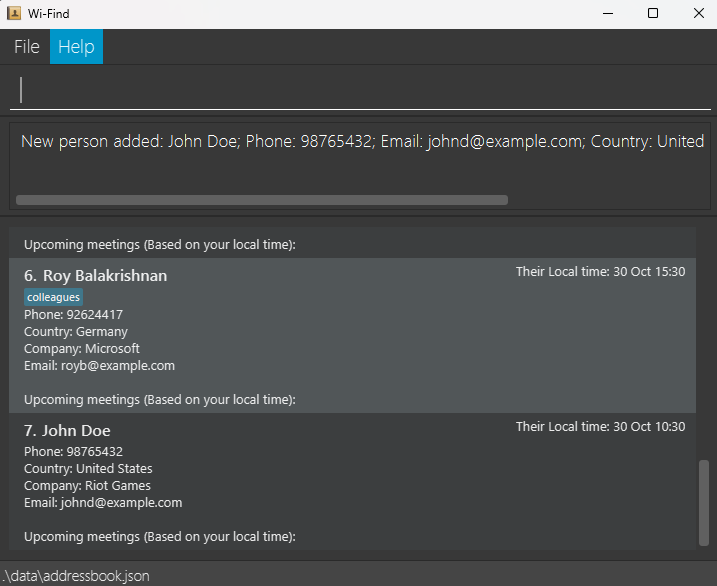
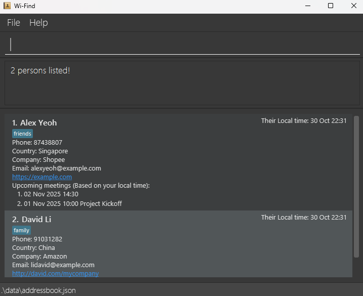

Wi-Find is a **desktop app for managing contacts**, optimized for use via a **Command Line Interface** (CLI),
It's designed for **freelance workers** who manage clients across multiple time zones, helping them manage multitude of contacts so they won't accidentally schedule meetings at 3 a.m!

Key features:
- Faster than typical GUI apps if you are able to type fast.
- Contact management through both country and company.
- Automatic timezone awareness.
- Fast text-based commands with immediate feedback.
- Set and record meeting times. (coming soon in v1.4)
- Filter contacts by company, country, meetings. (coming soon in v1.4)

### Table of contents
Use this table of contents to jump to any section!
* Table of Contents
{:toc}
--------------------------------------------------------------------------------------------------------------------

## Quick start

1. Install Java 17 or later. Not sure how? Follow this [installation guide for Windows.](https://se-education.org/guides/tutorials/javaInstallationWindows.html)<br>
   **Mac users:** Ensure you have the precise JDK version prescribed [here](https://se-education.org/guides/tutorials/javaInstallationMac.html).

2. Download the latest `.jar` file from [here](https://github.com/AY2526S1-CS2103T-T15-4/tp/releases).

3. Copy the file to the folder you want to use as the _home folder_ for Wi-Find.

4. Open a command terminal, `cd` into the folder you put the jar file in, and use the `java -jar WiFind.jar` command to run the application. (Ensure file name matches exactly when you type it in, else it won't work.)<br>
   A GUI similar to the below should appear in a few seconds, preloaded with sample data.<br>
   

5. Type the command in the command box and press Enter to execute it. e.g. typing **`help`** and pressing Enter will open the help window.<br>
   [Commands](#command-summary) follow the pattern of ```command parameter/prefix value```. Here are some example commands you can try:
   * `list` : Lists all contacts.

   * `add n/John Doe p/98765432 e/johnd@example.com c/Singapore com/Riot Games` : Adds a contact named `John Doe` accompanied by the given details to Wi-Find.

   * `delete 3` : Deletes the 3rd contact shown in the current list.

   * `clear` : Deletes all contacts.

   * `exit` : Exits the app.

6. Refer to the [Features](#features) below for details of each command.

--------------------------------------------------------------------------------------------------------------------

## Features

<div markdown="block" class="alert alert-info">
Commands in Wi-Find follow the same flexible format as described below.

**:information_source: Notes about the command format:**<br>

* Words in `UPPER_CASE` are the parameters to be supplied by the user.<br>
  - e.g. in `add n/NAME`, `NAME` is a parameter which can be used as `add n/John Doe`.

* Items in square brackets are optional.<br>
  - e.g. `n/NAME [t/TAG]` can be used as `n/John Doe t/friend` or as `n/John Doe`.

* Items with `…`​ after them can be used multiple times including zero times. (Unless stated otherwise.)<br>
  - e.g. `[t/TAG]…​` can be used as ` ` (i.e. 0 times), `t/friend`, `t/friend t/family` etc.

* Parameters can be in any order.<br>
  - e.g. if the command specifies `n/NAME p/PHONE_NUMBER`, `p/PHONE_NUMBER n/NAME` is also acceptable.

* Extraneous parameters for commands that do not take in parameters (such as `help`, `list`, `exit` and `clear`) will be ignored.<br>
  - e.g. if the command specifies `help 123`, it will be interpreted as `help`.

* Literal prefix input<br>
  - To include a token that looks like a prefix (e.g. n/, com/, c/) as part of a field value, wrap that token in square brackets with a leading space inside the brackets (for eg, [ com/]). The brackets are removed and the token is treated as literal text.
  - Important: do NOT put a space before the [ - the [ must be adjacent to the preceding text. Examples: add n/James ... c/Singapore[ com/] → country = Singapore com/.

* If you are using a PDF version of this document, be careful when copying and pasting commands that span multiple lines as space characters surrounding line-breaks may be omitted when copied over to the application.<br>

You can refer back to this section anytime while reading about specific commands.
</div>

### Viewing help : `help`

Opens a new window that shows a message explaining how to access the help page.

Format: `help`


<div markdown="span" class="alert alert-primary">
:exclamation: **Note:**
If you don't see the Help window, check if it's minimized (see <a href="#known-issues-as-of-v13">Known Issues</a>). 
</div>

### Adding a person: `add`

Adds a person to the address book.

Format: `add n/NAME p/PHONE_NUMBER e/EMAIL c/COUNTRY com/COMPANY [t/TAG]…​`

- Alphanumerics and special characters are allowed in NAME as well as the [local-part](https://en.wikipedia.org/wiki/Email_address#Local-part) of EMAIL.
<div markdown="span" class="alert alert-primary">
:exclamation: **IMPORTANT:**
Please check this <a href="#list-of-supported-countries">list</a> for available countries and their timezones.
</div>

After being successfully added, the GUI should show the added person, with the correct timezone of their country.


<div markdown="span" class="alert alert-primary">
:exclamation: **Note:**<br>
- Contacts are considered duplicates if they share the same phone number OR the same email address.<br>
- For example, <code>add n/Doe p/98765432</code> and <code>add n/Fish p/98765432</code> will be considered duplicates.<br>
- Email addresses are automatically lowercased when a contact is added or edited.<br>
- If a duplicate is detected, Wi-Find will show a warning; the contact will only be added if the user confirms. Users may still add a duplicate by approving the warning.<br>
</div>
<div markdown="span" class="alert alert-primary">:bulb: **Tip:**<br>
A person can have any number of tags (including 0)<br>
Duplicate users with either same phone or email will be allowed as long as the user permits it.<br>
</div>

Examples:
* `add n/John Doe p/98765432 e/johnd@example.com c/United States com/Riot Games`
* `add n/Betsy Crowe t/friend com/Jail e/betsycrowe@example.com c/United Kingdom p/1234567 t/criminal`

### Listing all persons : `list`

Shows a list of all persons in the address book.

Format: `list`

### Editing a person : `edit`

Edits an existing person in the address book.

Format: `edit INDEX [n/NAME] [p/PHONE] [e/EMAIL] [c/COUNTRY] [com/COMPANY] [t/TAG]…​`

* Edits the person at the specified `INDEX`. The index refers to the index number shown in the displayed person list. The index **must be a positive integer** 1, 2, 3, …​
* At least one of the optional fields must be provided.
* Existing values will be updated to the input values.
* When editing tags, the existing tags of the person will be removed i.e. adding of tags is not cumulative.
* You can **remove all the person’s tags by typing `t/`** without
    specifying any tags after it.

<div markdown="span" class="alert alert-primary">
:exclamation: **Note:**<br>
If the index given is out of range, Wi-Find will display "The person index provided is invalid" in the command box and no changes will occur.<br>
If you leave out all optional fields, Wi-Find will prompt you to enter at least one field.
</div>

Examples:
*  `edit 1 p/91234567 e/johndoe@example.com` Edits the phone number and email address of the 1st person to be `91234567` and `johndoe@example.com` respectively.
*  `edit 2 n/Betsy Crower t/` Edits the name of the 2nd person to be `Betsy Crower` and clears all existing tags.

### Locating persons by name: `find`

Finds persons through searching the parameters with given keywords.

Format: `find PARAMETER/[KEYWORD]...`

* Find requires at least 1 PARAMETER/[KEYWORD]
* The search is case-insensitive. e.g `hans` will match `Hans`
* The order of the keywords does not matter. e.g. `Hans Bo` will match `Bo Hans`
* PARAMETER is any of the fields when adding a contact.
* Multiple keywords under the same parameter works like `OR` search, while keywords across multiple parameters works like `AND` search. For example, `find n/Alex n/Bob c/Singapore` will display all contacts whose name includes 'Alex' OR 'Bob', AND has 'Singapore' under country parameter.

<div markdown="span" class="alert alert-primary">
:exclamation: **Note:**<br>
If no contacts match, Wi-Find will show an empty list. Use <code>list</code> to show all contacts again.<br>
Editing phone/email of contacts can trigger duplicate detection as well.<br>
</div>

Examples:
* `find n/John` returns `john` and `John Doe`
* `find n/alex n/david` returns `Alex Yeoh`, `David Li`<br>
  

### Flagging a person : `flag`

Flags the specified person from the address book.

Format: `flag INDEX`

* Flags the person at the specified `INDEX`.
* If the person is already flagged, an error message will be shown.
* The index refers to the index number shown in the displayed person list.
* The index **must be a positive integer** 1, 2, 3, …​

Examples:
* `list` followed by `flag 2` flags the 2nd person in the address book given that the contact is unflagged.
* `find n/Betsy` followed by 'flag 1' flags the 1st person in the result of the `find` command.
  

### Unflagging a person : `unflag`

Unflags the specified person from the address book.

Format: `unflag INDEX`

* Unflags the person at the specified `INDEX`.
* If the person is already unflagged, an error message will be shown.
* The index refers to the index number shown in the displayed person list.
* The index **must be a positive integer** 1, 2, 3, …​

Examples:
* `list` followed by `unflag 2` unflags the 2nd person in the address book given that the contact is flagged.
* `find n/Betsy` followed by 'unflag 1' unflags the 1st person in the result of the `find` command.
  

### Deleting a person : `delete`

Deletes the specified person from the address book.

Format: `delete INDEX`

* Deletes the person at the specified `INDEX`.
* The index refers to the index number shown in the displayed person list.
* The index **must be a positive integer** 1, 2, 3, …​

<div markdown="span" class="alert alert-primary">
:exclamation: **Note:**
This action cannot be undone!
</div>

Examples:
* `list` followed by `delete 2` deletes the 2nd person in the address book.
* `find n/Betsy` followed by `delete 1` deletes the 1st person in the results of the `find` command.

### Clearing all entries : `clear`

Clears all entries from the address book.

Format: `clear`

<div markdown="span" class="alert alert-primary">
:exclamation: **Note:**
This action cannot be undone!
</div>

### Exiting the program : `exit`

Exits the program safely.

Format: `exit`

### Saving the data

Wi-Find data are saved in the hard disk automatically after any command that changes the data. There is no need to save manually.

### Editing the data file

Wi-Find data are saved automatically as a JSON file `[JAR file location]/data/addressbook.json`. Advanced users are welcome to update data directly by editing that data file.

<div markdown="span" class="alert alert-warning">:exclamation: **Caution:**
If your changes to the data file makes its format invalid, Wi-Find will discard all data and start with an empty data file at the next run. Hence, it is recommended to take a backup of the file before editing it.<br>
Furthermore, certain edits can cause Wi-Find to behave in unexpected ways (e.g., if a value entered is outside the acceptable range). Therefore, edit the data file only if you are confident that you can update it correctly.
</div>

### Archiving data files `[coming in v2.0]`

_Details coming soon ..._

--------------------------------------------------------------------------------------------------------------------

## FAQ

**Q**: How do I check my Java version?<br>
**A**: Open your terminal, and run `java -version` to check.

**Q**: How do I transfer my data to another Computer?<br>
**A**: Install the app in the other computer and overwrite the empty data file it creates with the file that contains the data of your previous AddressBook home folder.

**Q**: Can I use Wi-Find on macOS and Windows?<br>
**A**: Yes you can! Just follow the [Quick Start](#quick-start) instructions and you'll be good to go!

**Q**: How do I reset sample data?<br>
**A**: Open folder containing `WiFind.jar`, navigate to `/data/addressbook.json`, and delete all contents inside.

--------------------------------------------------------------------------------------------------------------------

## Known issues (as of v1.3)

Issue 1: **When using multiple screens**, if you move the application to a secondary screen, and later switch to using only the primary screen, the GUI will open off-screen.<br>
Solution 1: The remedy is to delete the `preferences.json` file created by the application before running the application again.

Issue 2: **If you minimize the Help Window** and then run the `help` command (or use the `Help` menu, or the keyboard shortcut `F1`) again, the original Help Window will remain minimized, and no new Help Window will appear.<br>
Solution 2: The remedy is to manually restore the minimized Help Window.

--------------------------------------------------------------------------------------------------------------------

## Command summary

Some quick notes regarding how commands work:
- Duplicates: detected by same phone OR same email.
- Emails are automatically lowercased.
- User confirmation required to add duplicate contacts.

| Action                                     | Description                       | Format, Examples                                                                                                                                                                 |
|--------------------------------------------|-----------------------------------|----------------------------------------------------------------------------------------------------------------------------------------------------------------------------------|
| **[Add](#adding-a-person-add)**            | Adds contact                      | `add n/NAME p/PHONE_NUMBER e/EMAIL c/COUNTRY com/COMPANY [t/TAG]…​` <br> e.g., `add n/James Ho p/22224444 e/jamesho@example.com c/Singapore com/Riot Games t/friend t/colleague` |
| **[Clear](#clearing-all-entries--clear)**  | Clears contacts                   | `clear`                                                                                                                                                                          |
| **[Delete](#deleting-a-person--delete)**   | Deletes specified contact         | `delete INDEX`<br> e.g., `delete 3`                                                                                                                                              |
| **[Edit](#editing-a-person--edit)**        | Edits specified contact           | `edit INDEX [n/NAME] [p/PHONE_NUMBER] [e/EMAIL] [c/COUNTRY] [com/COMPANY] [t/TAG]…​`<br> e.g.,`edit 2 n/James Lee e/jameslee@example.com`                                        |
| **[Find](#locating-persons-by-name-find)** | Filters contacts based on keyword | `find PARAMETER/[KEYWORD]...`<br> e.g., `find n/James n/Jake`                                                                                                                    |
| **[Flag](#flagging-a-person--flag)**       | Flags contact                     | `flag INDEX`                                                                                                                                                                     |
| **[Unflag](#unflagging-a-person--unflag)** | Unflags contact                   | `unflag INDEX`                                                                                                                                                                   |
| **[List](#listing-all-persons--list)**     | List all contacts                 | `list`                                                                                                                                                                           |
| **[Help](#viewing-help--help)**            | Displays help window              | `help`                                                                                                                                                                           |

## List of supported countries

The following countries are supported for assigning a contact's location and corresponding timezone.<br>
Wi-Find uses these time zones to automatically display each contact's local time.

| Region   | Country Name      | Timezone              | UTC Offset |
|----------|-----------------|----------------------|------------|
| Africa   | Egypt           | `Africa/Cairo`         | UTC +02:00 |
|          | Kenya           | `Africa/Nairobi`       | UTC +03:00 |
|          | Nigeria         | `Africa/Lagos`         | UTC +01:00 |
|          | South Africa    | `Africa/Johannesburg`  | UTC +02:00 |
| Americas | Argentina       | `America/Buenos_Aires` | UTC -03:00 |
|          | Brazil          | `America/Sao_Paulo`    | UTC -03:00 |
|          | Canada          | `America/Toronto`      | UTC -05:00 |
|          | Mexico          | `America/Mexico_City`  | UTC -06:00 |
|          | United States   | `America/New_York`     | UTC -05:00 |
| Asia     | China           | `Asia/Shanghai`        | UTC +08:00 |
|          | India           | `Asia/Kolkata`         | UTC +05:30 |
|          | Japan           | `Asia/Tokyo`           | UTC +09:00 |
|          | Singapore       | `Asia/Singapore`       | UTC +08:00 |
|          | South Korea     | `Asia/Seoul`           | UTC +09:00 |
|          | UAE             | `Asia/Dubai`           | UTC +04:00 |
| Europe   | France          | `Europe/Paris`         | UTC +01:00 |
|          | Germany         | `Europe/Berlin`        | UTC +01:00 |
|          | Italy           | `Europe/Rome`          | UTC +01:00 |
|          | Netherlands     | `Europe/Amsterdam`     | UTC +01:00 |
|          | Norway          | `Europe/Oslo`          | UTC +01:00 |
|          | Spain           | `Europe/Madrid`        | UTC +01:00 |
|          | Sweden          | `Europe/Stockholm`     | UTC +01:00 |
|          | United Kingdom  | `Europe/London`        | UTC +00:00 |
| Oceania  | Australia       | `Australia/Sydney`     | UTC +10:00 |

