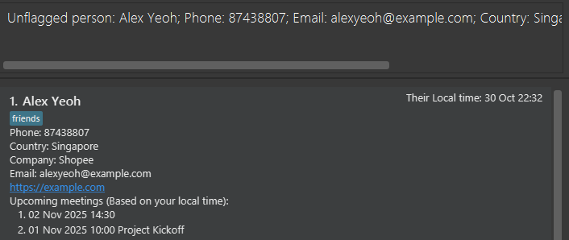
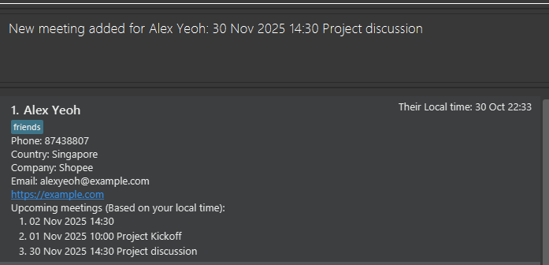
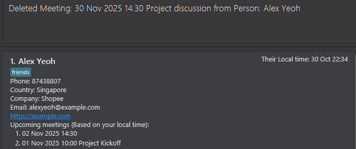
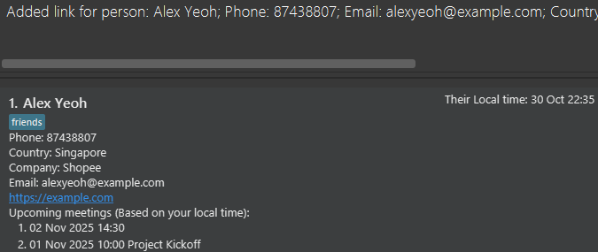

Wi-Find is a **desktop app for managing contacts**, optimized for use via a **Command Line Interface** (CLI),
It's designed for **freelance project managers** who need to manage clients across multiple time zones, helping them 
manage multitude of contacts so they won't accidentally schedule meetings at 3 a.m!

Key features:
- Faster than typical GUI apps if you are able to type fast.
- Contact management through both country and company.
- Automatic timezone awareness of contacts, displays their local time.
- Fast text-based commands with immediate feedback.
- Set meetings with contacts
- Find contacts by company, country, meetings.

<div style="page-break-after: always;"></div>


### Table of contents
Use this table of contents to jump to any section!
* Table of Contents
{:toc}
--------------------------------------------------------------------------------------------------------------------

<div style="page-break-after: always;"></div>


## Quick start

1. Wi-Find needs Java to run. Not sure how? Don't worry!
    - Windows users: Follow this [easy step-by-step guide](https://se-education.org/guides/tutorials/javaInstallationWindows.html)
    to install java
    - Mac users: Follow this [Mac guide](https://se-education.org/guides/tutorials/javaInstallationMac.html) to get 
      the exact version you need.
    - Linux users: Follow this [Linux guide](https://se-education.org/guides/tutorials/javaInstallationLinux.html)


2. Download Wi-Find
   1. Go to the [Wi-Find releases page](https://github.com/AY2526S1-CS2103T-T15-4/tp/releases).<br>
   2. Click on the latest version and download WiFind.jar.
   3. Choose a "Home" for Wi-Find<br>
   Pick a folder on your computer where you'd like Wi-Find to live - this is your **home folder**<br>
   Move the WiFind.jar file you just downloaded into that folder.


3. Run Wi-Find
   1. Open a **command prompt** (Windows), **terminal** (Mac) or **linux terminal/ Konsole** (Linux, depending on 
      your desktop environment)
   2. Go to the **home folder** you designated for Wi-Find:
   
      ```bash
      cd path/to/your/folder
      ``` 
   
        Note: Never used a terminal before? Don't worry, click [here](#detailed-guide-on-how-to-open-wi-find) to go to 
   our easy step-by-step guide on how to navigate the terminal.<br>

   3. Start Wi-Find by typing:
       ```bash
       java -jar WiFind.jar
       ```
   
      Ensure file name matches exactly when you type it in. If it doesn't open, double-check the spelling!


4. You're in!<br>

   After a few seconds, the Wi-Find window will appear - already loaded with sample data for you to explore!

   

   
5. Get familiar with Wi-Find! <br>
   Type the input in the command box and press Enter to execute it. e.g. typing **`help`** 
   and pressing Enter will open the help window.<br>
   [Commands](#command-summary) follow the pattern of ```command prefix/parameter...```. Here are some example commands you can try:
   * `list` : Lists all contacts.

   * `add n/John Doe p/98765432 e/johnd@example.com c/Singapore com/Riot Games` : Adds a contact named `John Doe` accompanied by the given details to Wi-Find.

   * `delete 3` : Deletes the 3rd contact shown in the current list.

   * `clear` : Deletes all contacts.

   * `exit` : Exits the app.


6. Refer to the [Features](#features) below for more details of each command.

--------------------------------------------------------------------------------------------------------------------

<div style="page-break-after: always;"></div>

## Command summary

Some quick notes regarding how commands work:
- Duplicates: detected by same phone OR same email.
- Emails are automatically lowercased.
- User confirmation required to add duplicate contacts.

| Action                                                           | Description                       | Format, Examples                                                                                                                                                                 |
|------------------------------------------------------------------|-----------------------------------|----------------------------------------------------------------------------------------------------------------------------------------------------------------------------------|
| **[Add](#adding-a-person-add)**                                  | Adds contact                      | `add n/NAME p/PHONE_NUMBER e/EMAIL c/COUNTRY com/COMPANY {t/TAG}…​` <br> e.g., `add n/James Ho p/22224444 e/jamesho@example.com c/Singapore com/Riot Games t/friend t/colleague` |
| **[Edit](#editing-a-person--edit)**                              | Edits specified contact           | `edit INDEX {n/NAME} {p/PHONE_NUMBER} {e/EMAIL} {c/COUNTRY} {com/COMPANY} {t/TAG}…​`<br> e.g.,`edit 2 n/James Lee e/jameslee@example.com`                                        |
| **[Delete](#deleting-a-person--delete)**                         | Deletes specified contact         | `delete INDEX`<br> e.g., `delete 3`                                                                                                                                              |
| **[List](#listing-all-persons--list)**                           | List all contacts                 | `list`                                                                                                                                                                           |
| **[Find](#locating-persons-by-name-find)**                       | Filters contacts based on keyword | `find {n/NAME}…​ {p/PHONE_NUMBER}…​ {e/EMAIL}…​ {c/COUNTRY}…​ {com/COMPANY}…​ {t/TAG}…​ {m/MEETING}…​ {l/LINK}…​`<br> e.g., `find n/James n/Jake`                                |
| **[Flag](#flagging-a-person--flag)**                             | Flags contact                     | `flag INDEX`                                                                                                                                                                     |
| **[Unflag](#unflagging-a-person--unflag)**                       | Unflags contact                   | `unflag INDEX`                                                                                                                                                                   |
| **[Add Meeting](#adding-a-meeting-to-a-person--addm)**           | Add Meeting to a contact          | `addm INDEX m/dd-MM-YYYY HH:MM Description` <br> e.g.` addm 1 m/12-02-2020 12:30 Project Star`                                                                                   |
| **[Delete Meeting](#deleting-a-meeting-from-a-person--deletem)** | Delete Meeting from a contact     | `deletem INDEX m/dd-MM-YYYY HH:MM` <br> e.g. `deletem 1 m/12-02-2020 12:30`                                                                                                      |
| **[List Meeting](#list-previous-meetings-of-a-person--listm)**   | List past meetings of contact     | `listm INDEX`                                                                                                                                                                    |
| **[Link](#managing-a-link-of-a-person--link)**                   | Manage a link                     | `link INDEX {LINK}`                                                                                                                                                              |
| **[Clear](#clearing-all-entries--clear)**                        | Clears contacts                   | `clear`                                                                                                                                                                          |
| **[Help](#viewing-help--help)**                                  | Displays help window              | `help`                                                                                                                                                                           |

<div style="page-break-after: always;"></div>

## Features

Commands in Wi-Find follow a flexible format as described below.

**:information_source: Command Format Notes:**

* **Prefix:** Short identifiers followed by a slash <code>/</code>.
    - Example: `n/`, `c/`, `com/`

* **Parameter:** The actual values provided by the user for a given prefix. A parameter always follows its prefix. 
  - Words in `UPPER_CASE` are placeholders for the parameter
    - Example: `add n/NAME` → use as `add n/John Doe`

* **Prefix-Parameter Pair:** A combination of a prefix and its corresponding parameter. This pair represents a single piece of information provided by the user.
  - Example: `n/John Doe` → `n/` is the prefix, `John Doe` is the parameter; together they form a prefix-parameter pair.

* **Optional items:** Squiggly brackets `{ }` indicate optional parameters.
  - Example: `n/NAME {t/TAG}` → use as `n/John Doe t/friend` or just `n/John Doe`

* **Multiple items:** `...` means a prefix-parameter pair can be repeated (including zero times unless stated otherwise).
  - Example: `{t/TAG}...` → use as nothing, `t/friend`, or `t/friend t/family`

* **Prefix-Parameter Pair order:** Prefix-Parameter Pairs can appear in any order.
  - Example: `n/NAME p/PHONE_NUMBER` and `p/PHONE_NUMBER n/NAME` both work

* **Command:** The first word in a user input that specifies the action the application should perform. It tells the program what to do with the provided input.
    - Example: `add`, `delete`, `find`

* **Extra Command:** Commands like `help`, `list`, `exit`, and `clear` that ignore extra input.
  - Example: `help 123` is interpreted as `help`

* **Input:** The complete string entered by the user into the application. It contains the command and any associated arguments or prefix-parameter pairs.
    - Example: `add n/John Doe p/98765432 e/johnd@example.com c/Singapore com/Shopee t/friends t/owesMoney`

* **Literal prefix input** If your input contains text that looks like a prefix (e.g., "n/", "com/"), wrap it in brackets with a leading space: <code>[ prefix/]</code>
  - Format: One space goes **INSIDE** the opening bracket: <code>[ com/]</code> ✓
  - The brackets are removed automatically, leaving only the text
  - Prefix-like text attached to other text (e.g., <code>Singaporecom/</code>) is saved **as is**
  - Examples:
    - `add n/John p/81234567 e/john@gmail.com c/Singapore com/Shoppee[ c/]` → Company: "Shoppe c/"
    - `add n/Jane[ n/] Doe p/87654321 e/jane@gmail.com c/China com/Google` → Name: "Jane n/ Doe"
  - **Important:**
    - Text after "/" should be typed **outside** the square brackets → <code>[ prefix/]text</code>✓, <code>[ prefix/text]</code>✗
  - **Why this happens:** Wi-Find uses prefixes like "n/" and "c/" to identify different fields. Without the bracket 
    notation, "n/Jody p/" would be interpreted as name "Jody" followed by a new phone field instead of name "Jody p/".

* **PDF Warning:** When copying multi-line commands from PDF, spaces around line breaks may be lost

<div markdown="span" class="alert alert-primary">
:exclamation: **Note:**
You can refer back to this section anytime while reading about specific commands.
</div>

<div style="page-break-after: always;"></div>

### Viewing help : `help`

Opens a new window that shows a message explaining how to access the help page.

Format: `help`


<div markdown="span" class="alert alert-primary">
:exclamation: **Note:**
If you don't see the Help window, check if it's minimized (see <a href="#known-issues-as-of-v13">Known Issues</a>). 
</div>

<div style="page-break-after: always;"></div>

### Adding a person: `add`

Adds a person to the address book.

Format: `add n/NAME p/PHONE_NUMBER e/EMAIL c/COUNTRY com/COMPANY {t/TAG}…​`

- Alphanumerics and special characters are allowed in NAME.
- Phone numbers should only contain numbers, spaces, or the characters <code>+</code>, <code>-</code>, <code>(</code>, <code>)</code>.

**Email Address Rules (Summary Table)**

**Definitions:**
- **Local Part:** The portion before the `@` symbol, identifying the user or mailbox.
- **Domain Part:** The portion after the `@` symbol, identifying the mail server or organization.

| Part | Rules | Examples |
|------|-------|---------|
| **Local Part** | - Must start with an **alphanumeric character** (A-Z, a-z, 0-9)<br>- **Underscores (`_`) are not allowed**<br>- Must have at least **1 character**<br>- Allowed special characters: see list below | Valid: <code>john</code>, <code>john.doe</code>, <code>jane-doe+mail</code><br>Invalid: <code>_john</code>, <code>john__doe</code>, <code>.john</code> |
| **Domain Part** | - Made of **domain labels** separated by periods (`.`)<br>- **Ending label:** at least **2 characters long**<br>- Each label must **start and end with alphanumeric characters**<br>- Only **alphanumeric characters** or **hyphens (`-`)** allowed in the middle | Valid: <code>example.com</code>, <code>my-site.org</code>, <code>sub.domain.co</code><br>Invalid: <code>-example.com</code>, <code>example-.com</code>, <code>ex!ample.com</code> |
| **Full Email** | - Combine local part + `@` + domain part<br>- Maximum length: **255 characters** | Valid: <code>john.doe@example.com</code>, <code>jane-doe+mail@sub.domain.co</code><br>Invalid: <code>_john@example.com</code>, <code>john@-example.com</code>, <code>john@example.c</code> |

**Allowed special characters in the local part:**  
<code>! # $ % & ' * + - / = ? ^ ` { | } ~ .</code>

<div markdown="span" class="alert alert-primary">
:exclamation: **IMPORTANT:**
Please check this <a href="#list-of-supported-countries">list</a> for available countries and their timezones, as the <code>COUNTRY</code>
parameter determines the contact's timezone display on the app.
</div>

After being successfully added, the GUI should show the added person, with the correct timezone of their country.


Examples:
* `add n/John Doe p/98765432 e/johnd@example.com c/United States com/Riot Games`
* `add n/Betsy Crowe t/friend com/Jail e/betsycrowe@example.com c/United Kingdom p/1234567 t/criminal`

<div markdown="span" class="alert alert-primary">
:exclamation: **Note:**<br>
- Contacts are considered duplicates if they share the same phone number OR the same email address with an existing contact.<br>
- Email addresses are automatically lowercased when a contact is added or edited.<br>
- A person can have any number of tags (including 0).<br>
- Tags are unique: adding the same tag multiple times has no effect.<br>
- Countries are strictly alphabetical.<br>
</div>

<div markdown="span" class="alert alert-warning">
:exclamation: **Duplicate Detection:**<br>
When you attempt to add a contact that shares a phone number or email with an existing contact, Wi-Find will:<br>

1. Display a warning showing the conflicting details<br>
2. Prompt you to confirm whether you want to proceed<br>
3. Add the contact only after you approve the warning<br>
<br>
**Example:** If you have <code>John Doe</code>code> **(phone: 98765432)** in your contacts and you try to add <code>Jane Doe</code> with the same phone number, Wi-Find will warn you about the duplicate and ask for confirmation before adding <code>Jane Doe</code>.<br>
<br>
This feature helps prevent accidental duplicates while allowing you to intentionally add contacts with shared phone numbers or emails (e.g., family members sharing a phone, employees sharing a company email).

**WARNING:** There will be **NO** confirmation message of cancellation when you cancel the warning prompt! (Applies to any command with the same duplicate-handling behaviour)
</div>

<div style="page-break-after: always;"></div>

### Editing a person : `edit`

Edits an existing person in the address book.

Format: `edit INDEX {n/NAME} {p/PHONE_NUMBER} {e/EMAIL} {c/COUNTRY} {com/COMPANY} {t/TAG}…​`

* Edits the person at the specified `INDEX`. The index refers to the index number shown in the displayed person list. The index **must be a positive integer** 1, 2, 3, …​
* At least one of the optional items must be provided.
* Existing parameters will be updated to the new parameter values.
* When editing tags, the existing tags of the person will be removed i.e. adding of tags is not cumulative.
* You can **remove all the person’s tags by typing `t/`** without
    specifying any tags after it.

<div markdown="span" class="alert alert-primary">
:exclamation: **Note:**<br>
If the index given is out of range, Wi-Find will display "The person index provided is invalid" in the command box and no changes will occur.<br>
If you leave out all optional items, Wi-Find will prompt you to enter at least one field.<br>
Editing phone/email of contacts can trigger duplicate detection as well.<br>
</div>

Examples:
*  `edit 1 p/91234567 e/johndoe@example.com` Edits the phone number and email address of the 1st person to be `91234567` and `johndoe@example.com` respectively.
*  `edit 2 n/Betsy Crower t/` Edits the name of the 2nd person to be `Betsy Crower` and clears all existing tags.

<div style="page-break-after: always;"></div>

### Deleting a person : `delete`

Deletes the specified person from the address book.

Format: `delete INDEX`

* Deletes the person at the specified `INDEX`.
* The index refers to the index number shown in the displayed person list.
* The index **must be a positive integer** 1, 2, 3, …​

<div markdown="span" class="alert alert-primary">
:exclamation: **Note:**
This action cannot be undone!
</div>

Examples:
* `list` followed by `delete 2` deletes the 2nd person in the address book.
* `find n/Betsy` followed by `delete 1` deletes the 1st person in the results of the `find` command.

<div style="page-break-after: always;"></div>

### Listing all persons : `list`

Shows a list of all persons in the address book.

Format: `list`

<div style="page-break-after: always;"></div>

### Locating persons by parameters: `find`

Finds persons through searching the parameters with given keywords.

Format: `find {n/NAME}…​ {p/PHONE_NUMBER}…​ {e/EMAIL}…​ {c/COUNTRY}…​ {com/COMPANY}…​ {t/TAG}…​ {m/MEETING}…​ {l/LINK}…​`

* <code>find</code> requires at least 1 Prefix-Parameter Pair
* The search is case-insensitive. e.g. `hans` will match `Hans`
* The search is done by substring searching. e.g. `an` will match `Hans`
* Multiple keywords under the same prefix works like `OR` search, while keywords across multiple prefixes works like `AND` search. For example, `find n/Alex n/Bob c/Singapore` will display all contacts whose name includes 'Alex' OR 'Bob', AND has 'Singapore' under country prefix.
* When searching for meetings, use `DD MMM YYYY HH:MM <Description>` format, as displayed on the contact list.

<div markdown="span" class="alert alert-primary">
:exclamation: **Note:**<br>
If no contacts match, Wi-Find will show an empty list. Use <code>list</code> to show all contacts again.<br>
</div>

Examples:
* `find n/John` returns `john` and `John Doe`
* `find n/Bri` returns `Brian Tay`
* `find m/31 Oct 2025 18:00 Project discussion` returns meeting with meeting time `31 Oct 2025 18:00` and description `Project discussion`
* `find n/alex n/david` returns `Alex Yeoh`, `David Li`<br>
  

<div style="page-break-after: always;"></div>

### Flagging a person : `flag`

Flags the specified person from the address book for quick identification.

Format: `flag INDEX`

* Flags the person at the specified `INDEX`.
* If the person is already flagged, an error message will be shown.
* The index refers to the index number shown in the displayed person list.
* The index **must be a positive integer** 1, 2, 3, …​

Examples:
* `list` followed by `flag 2` flags the 2nd person in the address book given that the contact is unflagged.
* `find n/Alex` followed by 'flag 1' flags the 1st person in the result of the `find` command.
  

<div style="page-break-after: always;"></div>

### Unflagging a person : `unflag`

Unflags the specified person from the address book.

Format: `unflag INDEX`

* Unflags the person at the specified `INDEX`.
* If the person is already unflagged, an error message will be shown.
* The index refers to the index number shown in the displayed person list.
* The index **must be a positive integer** 1, 2, 3, …​

Examples:
* `list` followed by `unflag 2` unflags the 2nd person in the address book given that the contact is flagged.
* `find n/Alex` followed by 'unflag 1' unflags the 1st person in the result of the `find` command.
  

<div style="page-break-after: always;"></div>

### Adding a meeting to a person : `addm`

Adds a meeting to the person.

Format `addm INDEX m/dd-MM-YYYY HH:MM {description}`

* Adds a meeting to the person at the specified `INDEX`.
* If there already exists a meeting with any person (i.e Meetings that have same date and time) in Wi-Find, confirmation will be required by the user, similar to add.
* The index refers to the index number shown in the displayed person list
* The index **must be a positive integer** 1, 2, 3, …​
* The meeting time provided must follow the format dd-MM-YYYY HH:MM
* The description is optional and limited to up to 50 characters.
* Meeting times will be displayed as you input it, Wi-Find will determine whether it has already passed using 
  your local time, hence it is highly recommended to put meetings in your local time.
* Only upcoming meeting times are displayed in the GUI, for past meetings, see **[List Meeting](#list-previous-meetings-of-a-person--listm)**.
* Upcoming meeting section will be refreshed whenever the user edits that specified contact or reopens the app.
* Note: Each contact can have multiple meetings associated with them. Although there is no enforced limit, for optimal 
  performance and readability, it is recommended to keep the number of meetings per contact below 50.

Examples:
* `list` followed by `addm 1 m/30-10-2025 14:30 Project discussion` adds a meeting to the first contact, given that 
  there are no meetings scheduled at that time for all contacts.
  

<div style="page-break-after: always;"></div>

### Deleting a meeting from a person : `deletem`

Deletes a meeting with a specified date and time from a person.

Format `deletem INDEX m/dd-MM-YYYY HH:MM`

* Deletes a meeting to the person at the specified `INDEX`.
* If the person does not have a meeting with the specified date and time, an error will be shown.
* The index refers to the index number shown in the displayed person list
* The index **must be a positive integer** 1, 2, 3, …​
* The meeting time provided must follow the format dd-MM-YYYY HH:MM

Examples:
* `list` followed by `deletem 1 m/20-10-2025 14:30` deletes a meeting from the first contact, given that there exists 
  a meeting at that date and time for that contact. (Note that both past and future meetings can be deleted and follow the same behaviour)
  

<div style="page-break-after: always;"></div>

### List previous meetings of a person : `listm`

Lists all past meetings with specified person.

Format: `listm INDEX`

* The index refers to the index number shown in the displayed person list
* The index **must be a positive integer** 1, 2, 3, …​

Example:<br>


<div style="page-break-after: always;"></div>

### Managing a link of a person : `link`

Adds/updates/remove a link from the specified person from the address book.

Format: `link INDEX {LINK}`

* Adds a link to the person at the specified `INDEX` using `link INDEX LINK`.
* If the person already has a link, the link will be updated according to the latest input from user. 
* To remove the link from a person, use `link INDEX` without the `LINK` parameter.
* The index refers to the index number shown in the displayed person list.
* The index **must be a positive integer** 1, 2, 3, …​
* The link provided by user must be a valid link. 

Examples:
* `list` followed by `link 2` removes the link from the 2nd person listed in the address book given that the contact has a link previously.
* `find n/Alex` followed by `link 1 https://example.com` adds the link to the 1st person in the result of the `find` command.
  

<div style="page-break-after: always;"></div>

### Clearing all entries : `clear`

Clears all entries from the address book.

Format: `clear`

<div markdown="span" class="alert alert-primary">
:exclamation: **Note:**
WARNING: There is no confirmation message and this action cannot be undone!
</div>

<div style="page-break-after: always;"></div>

### Exiting the program : `exit`

Exits the program safely.

Format: `exit`

### Saving the data

Wi-Find data are saved in the hard disk automatically after any command that changes the data. There is no need to save manually.

### Editing the data file

Wi-Find data are saved automatically as a JSON file `JAR_FILE_LOCATION/data/addressbook.json`. Advanced users are welcome to update data directly by editing that data file.

<div markdown="span" class="alert alert-warning">:exclamation: **Caution:**
If your changes to the data file makes its format invalid, Wi-Find will discard all data and start with an empty data file at the next run. Hence, it is recommended to take a backup of the file before editing it.<br>
Furthermore, certain edits can cause Wi-Find to behave in unexpected ways (e.g., if a value entered is outside the acceptable range). Therefore, edit the data file only if you are confident that you can update it correctly.
</div>

### Archiving data files `[coming in v2.0]`

_Details coming soon ..._

--------------------------------------------------------------------------------------------------------------------

<div style="page-break-after: always;"></div>

## FAQ

**Q**: How do I check my Java version?<br>
**A**: Open your terminal, and run `java -version` to check.

**Q**: How do I transfer my data to another Computer?<br>
**A**: Install the app in the other computer and overwrite the empty data file it creates with the file that contains the data of your previous AddressBook home folder.

**Q**: Can I use Wi-Find on macOS and Windows?<br>
**A**: Yes you can! Just follow the [Quick Start](#quick-start) instructions and you'll be good to go!

**Q**: How do I reset sample data?<br>
**A**: Open folder containing `WiFind.jar`, navigate to `/data/addressbook.json`, and delete all contents inside.

--------------------------------------------------------------------------------------------------------------------

<div style="page-break-after: always;"></div>

## Known issues (as of v1.6)

Issue 1: **When using multiple screens**, if you move the application to a secondary screen, and later switch to using only the primary screen, the GUI will open off-screen.<br>
Solution 1: The remedy is to delete the `preferences.json` file created by the application before running the application again.

Issue 2: **If you minimize the Help Window** and then run the `help` command (or use the `Help` menu, or the keyboard shortcut `F1`) again, the original Help Window will remain minimized, and no new Help Window will appear.<br>
Solution 2: The remedy is to manually restore the minimized Help Window.

Issue 3: **Non-latin unicode characters** displayed as ▯ on **Linux (Ubuntu)** systems


Affected platforms:
- Linux distributions
- Wi-Find versions ≤ 1.6


Temporary workaround: Install full Unicode-compatible fonts on your Linux system, then restart Wi-Find
```bash
sudo apt install fonts-noto fonts-noto-cjk fonts-noto-color-emoji fonts-noto-arabic
```

If the issue persists, launch Wi-Find using the following command to ensure UTF-8 encoding is enforced:
```bash
java -Dfile.encoding=UTF-8 -jar WiFind.jar
```

Planned Resolution:
Future versions of Wi-Find will include improved cross-platform font handling to ensure all Unicode characters are 
displayed correctly by default, regardless of operating system.


--------------------------------------------------------------------------------------------------------------------

<div style="page-break-after: always;"></div>

## List of supported countries

The following countries are supported for assigning a contact's location and corresponding timezone.<br>
Wi-Find uses these time zones to automatically display each contact's local time.

<div markdown="span" class="alert alert-primary">
:exclamation: **IMPORTANT:**<br>
UTC Offset given below does not accurately provide time difference, due to the usage of DST in some countries. For more information, check <a href="https://www.iana.org/time-zones" target="_blank">here.</a>
</div>

| Region   | Country Name      | Timezone              | UTC Offset |
|----------|-----------------|----------------------|------------|
| Africa   | Egypt           | `Africa/Cairo`         | UTC +02:00 |
|          | Kenya           | `Africa/Nairobi`       | UTC +03:00 |
|          | Nigeria         | `Africa/Lagos`         | UTC +01:00 |
|          | South Africa    | `Africa/Johannesburg`  | UTC +02:00 |
| Americas | Argentina       | `America/Buenos_Aires` | UTC -03:00 |
|          | Brazil          | `America/Sao_Paulo`    | UTC -03:00 |
|          | Canada          | `America/Toronto`      | UTC -05:00 |
|          | Mexico          | `America/Mexico_City`  | UTC -06:00 |
|          | United States   | `America/New_York`     | UTC -05:00 |
| Asia     | China           | `Asia/Shanghai`        | UTC +08:00 |
|          | India           | `Asia/Kolkata`         | UTC +05:30 |
|          | Japan           | `Asia/Tokyo`           | UTC +09:00 |
|          | Singapore       | `Asia/Singapore`       | UTC +08:00 |
|          | South Korea     | `Asia/Seoul`           | UTC +09:00 |
|          | UAE             | `Asia/Dubai`           | UTC +04:00 |
| Europe   | France          | `Europe/Paris`         | UTC +01:00 |
|          | Germany         | `Europe/Berlin`        | UTC +01:00 |
|          | Italy           | `Europe/Rome`          | UTC +01:00 |
|          | Netherlands     | `Europe/Amsterdam`     | UTC +01:00 |
|          | Norway          | `Europe/Oslo`          | UTC +01:00 |
|          | Spain           | `Europe/Madrid`        | UTC +01:00 |
|          | Sweden          | `Europe/Stockholm`     | UTC +01:00 |
|          | United Kingdom  | `Europe/London`        | UTC +00:00 |
| Oceania  | Australia       | `Australia/Sydney`     | UTC +10:00 |

--- 
<div style="page-break-after: always;"></div>

# Detailed guide on how to open Wi-Find


####  Step 1: Open a terminal (also called a “command prompt”)

The **terminal** is a small window where you can type commands for your computer.  
Here’s how to open it:

- **Windows:**
    - Press **Windows + R**, type `cmd`, and hit **Enter**.
    - A black window will appear — that’s your Command Prompt.

- **Mac:**
    - Open **Spotlight Search** (press **Command + Space**)
    - Type `Terminal`, then press **Enter**.
    - A white or black window will appear — that’s your Terminal.

- **Linux**
    - Press **Ctrl + Alt + T** to open a new terminal window.
    - Alternatively, you can open it from your applications menu — search for “**Terminal**” or “**Konsole**” 
      (depending on your desktop environment).
    - A terminal window will open, ready for commands.


#### Step 2: Go to the folder where Wi-Find is

In the terminal, type `cd` followed by the path to the **home folder** where you saved `WiFind.jar` previously.
For example:
```bash
    cd Desktop/WiFindHomeFolder
```

Tip: You can also drag the folder into the terminal window, it will automatically fill in the correct path!

#### Step 3: Start Wi-Find by typing:
```bash
java -jar WiFind.jar
```

   Ensure file name matches exactly when you type it in. If it doesn't open, double-check the spelling!

All done! Get familiar with WiFind continuing with step 4 in [Quick Start](#quick-start)!

