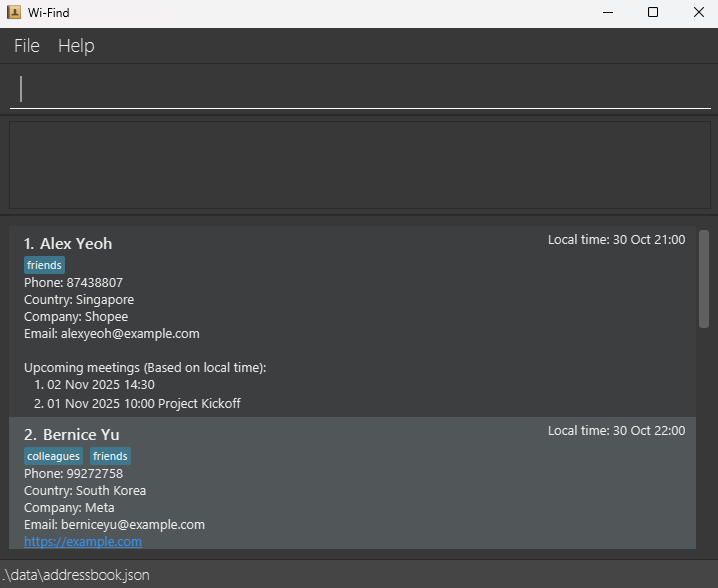

  <h1 style="font-size:2.5em; font-weight:700; margin-bottom:0.5rem;">Wi-Find</h1>
  
Contact & Meeting Manager for Busy Professionals

---

## Why Wi-Find?

Wi-Find helps you stay effortlessly connected - manage contacts, track meetings, and flag important people, all from one simple interface.

- **All-in-one contact book** - Store names, emails, companies, and tags.
- **Integrated meetings** - Add, delete, and list meetings per contact.
- **Smart flags** - Mark VIPs and important clients for quick access.
- **Keyboard-driven productivity** - Optimized for fast CLI commands.
- **Seamless organization** - Never lose touch with your network again.

---

  

---

## Get Started

- [User Guide](https://ay2526s1-cs2103t-t15-4.github.io/tp/UserGuide.html) - Learn how to install and use Wi-Find
- [Developer Guide](https://ay2526s1-cs2103t-t15-4.github.io/tp/DeveloperGuide.html) - For contributors and advanced users

---

**Acknowledgements**

Built with [JavaFX](https://openjfx.io/), [Jackson](https://github.com/FasterXML/jackson), and [JUnit5](https://github.com/junit-team/junit5).  
Inspired by the [SE-EDU initiative](https://se-education.org).

  
  

